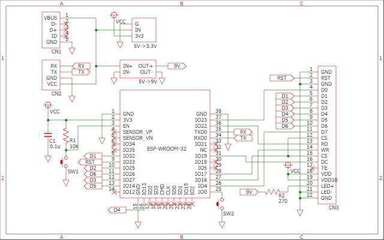
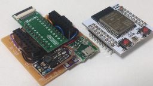
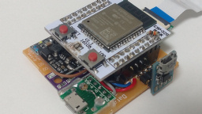
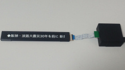

# ESP32MjkIrisRss


Something like electric bulletin board displaying headlines of news using an ESP-WROOM-32 and a 640&times;48 LCD.

## Hardware

### Components

* An [ESP-WROOM-32](https://www.espressif.com/en/products/modules?id=ESP32)
* A 640&times;48 LCD with an FFC cable (by disassembling [Majoka Iris](https://www.takaratomy.co.jp/products/magimajopures/toy/25/))
* A [DC-DC converter (9V)](https://www.aitendo.com/product/18515)
* A [LDO module (3.3V)](https://www.aitendo.com/product/20341)
* A [USB to serial UART module](http://akizukidenshi.com/catalog/g/gM-08461/)
* Two tactile switches
* Two resistors: a 10k&ohm; and a 270&ohm;
* A 0.1&mu;F ceramic capacitor
* A USB connector for power supply
* Wires, connectors, etc...

### Schematic

[](doc/schematic.png)

### Examples

[](doc/picture1.jpg)
[](doc/picture2.jpg)
[](doc/picture3.jpg)

## Software

### Build environment

[Install ESP32 boards to the Arduino IDE](https://docs.espressif.com/projects/arduino-esp32/en/latest/installing.html#installing-using-arduino-ide) and configure the settings as follows.

Attribute        |Value
-----------------|------------------------------
Board            |ESP32 Dev Module
JTAG Adapter     |Disabled
PSRAM            |Disabled
Partition Scheme |No OTA (2MB APP/2MB SPIFFS)
CPU Frequency    |240MHz (WiFi/BT)
Flash Mode       |QIO
Flash Frequency  |80MHz
Flash Size       |4MB (32Mb)
Upload Speed     |921600
Arduino Runs On  |Core 1
Events Runs On   |Core 1
Core Debug Level |None
Erase All Flash Before Sketch Upload|Disabled

This sketch depends on following libraries. (You can add these by library manager)

* [LovyanGFX](https://github.com/lovyan03/LovyanGFX) version 1.1.16

You must modify some files according to your situation.

* Edit `MY_SSID` and `MY_PASSWORD` in ["credentials.h"](credentials.h) for your Wi-Fi access point

```
#define MY_SSID     "SSID"
#define MY_PASSWORD "PASSWORD"
```

* Edit arguments of calling `getAndParseRss()` function in ["MyRssManager.cpp"](MyRssManager.cpp) as you like.
* Get root certificate files and define as arrays of `const char` in ["certificates.h"](certificates.h).

```
    getAndParseRss("www3.nhk.or.jp", rootCA_NHK, "/rss/news/cat0.xml");
    getAndParseRss("www.asahi.com", rootCA_AsahiCom, "/rss/asahi/newsheadlines.rdf");
```

### License

These codes are licensed under [MIT License](LICENSE).

## References

* [マジョカアイリスハック | honeylab's blog](https://honeylab.hatenablog.jp/entry/2021/01/08/131422)
* [TFT_Test_48x640 | GitHub by kingyoPiyo](https://github.com/kingyoPiyo/TFT_Test_48x640)
* [今更ながらマジョカアイリスハックした | koktoh の雑記帳](https://koktoh.hatenablog.com/entry/2021/04/23/232551)
* [(Lチカならぬ)寿司チカ | GitHub by htlabnet](https://github.com/htlabnet/inside_magimajopures/wiki/sushi_chika)
* [マジョカアイリス Yahoo! News 電光表示板 | GitHub by pokibon3](https://github.com/pokibon3/MajokaIrisHack/tree/master/YahooNewsEx2)
* [ESP32-S3で1.9"IPSカラーLCDをパラレル接続した | Qiita by nak435](https://qiita.com/nak435/items/e271cdf3713ff3c88731)
